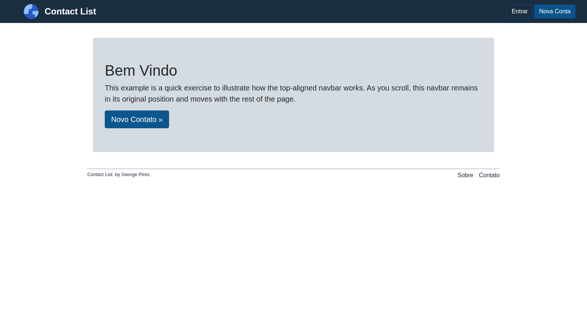

<h1 align="center"> 👤 Contact list</h1>

<br>
<div align="center">
    
</div>
<br>

## 💻 Projeto

Contact List! crie, personalize e gerencie sua lista de contatos de qualquer lugar.

## 🚀 Tecnologias

<table>
  <tr>
    <td>Ruby version</td>
    <td>
      2.6.3
    </td>
  </tr>
  <tr>
    <td>Rails version</td>
    <td>
      5.2.8
    </td>
  </tr>
  <tr>
    <td>Database</td>
    <td>
     PostgreSQL 
    </td>
  </tr>
</table>

## ⚡ Instalando o Projeto

```bash
# clonar o projeto
git clone https://github.com/GeorgePires/contact_list.git

# entre no diretório clonado
cd contact_list

# instalar dependências do Ruby on Rails
bundle install

# criar os bancos de dados de desenvolvimento e teste
rails db:create

# crie as tabelas
rails db:migrate

# executar o projeto
rails s
```
Entre no endereço `http://localhost:3000`
