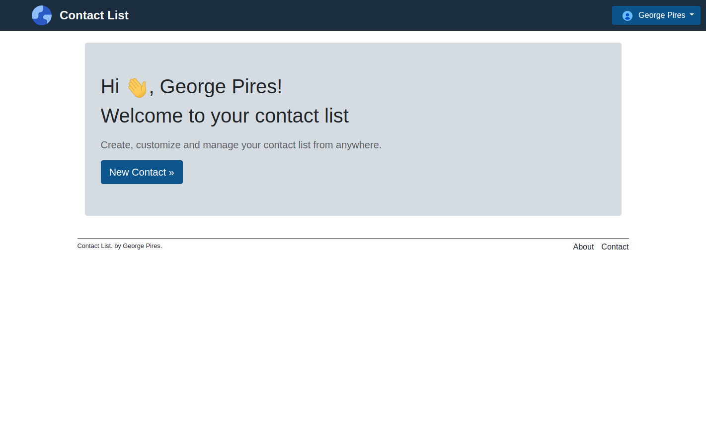

<h1 align="center"> 👤 Contact list</h1>

<br>
<div align="center">
    
</div>
<br>

## 💻 Projeto

 Contact list! Crie, personalize e gerencie sua lista de contatos de qualquer lugar.

## 🚀 Tecnologias

|                |             |     Gems       |
|----------------|-------------|----------------|
| Ruby version   | 2.6.3       | Bootstrap 4    |
| Rails version  | 5.2.8       | Devise         | 
| Database       | PostgreSQL  | Simple Form    |
|                |             | Kaminari       | 
|                |             | Carrierwave    | 
|                |             | Fog-AWS        |
                                           

## 💥 Funcionalidades

- [x] Cadastro e Login de usuários.
- [x] Gerenciamento de contatos - CRUD de contatos. 
- [x] Customização do perfil - Upload de arquivos na AWS S3.

## ⚡ Instalando o Projeto

```bash
# clonar o projeto
git clone https://github.com/GeorgePires/contact_list.git

# entre no diretório clonado
cd contact_list

# instalar dependências do Ruby on Rails
bundle install

# criar os bancos de dados de desenvolvimento e teste
rails db:create

# crie as tabelas
rails db:migrate

# executar o projeto
rails s
```
Entre no endereço `http://localhost:3000`
